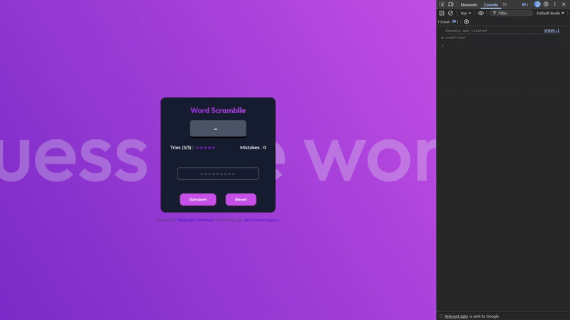

## Guess the Word Game - Overview

This is a simple **Guess the Word** game.
The player is given a scrambled word and has **5 attempts** to guess the correct word before the game resets.

The game includes:

- A **mistakes section** that shows wrongly guessed letters so the player can adjust future guesses.
- A **Random Word** button to generate a new scrambled word.
- A **Reset** button to restart the game at any point.



This project was originally attempted a few months ago, but I couldn’t complete it due to getting completely stuck on the JavaScript logic.

---

## Why This Attempt Worked (and the First One Didn’t)

When I first tried building this game, I didn’t yet have the ability to _construct logic on my own_. I could follow tutorials, but once I had to design the flow myself, I hit a wall.

After completing roughly half of the **JavaScript30 (JS30)** course, I revisited this challenge. By this point, I had a better understanding of:

- State handling
- Condition-based game flow
- Event-driven logic
- Breaking down problems instead of guessing solutions

I also forced myself to **not abandon this project halfway**, even when the logic felt messy. That constraint alone pushed me to think through the problem instead of restarting something else.

The goal here wasn’t perfect code — it was to make the game **work end to end**, which it now does.

---

## Known Bug

There is a known issue in the **mistakes section**:

- After losing all chances and the game resetting, the mistakes count **occasionally does not reset to zero**.
- In most cases it works correctly, but the state update is not fully consistent.

This is acknowledged and left intentionally unfixed for now, as the focus of this project was completing the game logic.

---

## Code Quality (Honest Self-Review)

Although the game logic functions correctly, the code still shows several traits that separate **beginner-level working code** from **professional, clean, maintainable code**, as described in _Clean Code_ by Robert C. Martin. The biggest issue is uncontrolled **global mutable state**. Variables such as `enteredUserWord`, `triesLeft`, `mistakes`, and `correct` are defined globally and silently read or mutated by multiple functions. This makes control flow harder to reason about and nearly impossible to test in isolation. A professional approach is to use a **single game state object** so all state is explicit and centralized:

```js
const gameState = {
  originalWord: "",
  scrambledWord: "",
  enteredWord: "",
  triesLeft: 5,
  mistakes: [],
};
```

Functions should then **receive and return state**, rather than mutating globals, which dramatically improves traceability and maintainability.

Another major issue is **functions doing too much**. For example, `handleInput` currently reads keyboard input, validates logic, updates game state, triggers alerts, resets the game, and updates the UI. This violates the Clean Code principle that _a function should do only one thing_. A professional solution is to split responsibilities into smaller functions:

```js
function handleInput(e) {
  updateEnteredWord(e.key);
  if (isGuessComplete()) {
    const result = evaluateGuess();
    handleResult(result);
    updateUI();
  }
}
```

Each function now has a single, well-defined responsibility, making the code easier to reason about and modify.

The **word scrambling logic** is another subtle amateur signal. The current solution generates a random index list and checks duplicates using string matching:

```js
if (numSequence.join("").includes(randomNum)) continue;
```

This is fragile and inefficient. The professional, industry-standard solution is the **Fisher–Yates shuffle**, which is simpler, safer, and faster:

```js
function scramble(word) {
  const arr = [...word];
  for (let i = arr.length - 1; i > 0; i--) {
    const j = Math.floor(Math.random() * (i + 1));
    [arr[i], arr[j]] = [arr[j], arr[i]];
  }
  return arr.join("");
}
```

Another important issue is tight **coupling between game logic and DOM/UI logic**. Functions like `checkInput` and `handleInput` directly trigger alerts and manipulate the DOM. Clean Code encourages separating **logic from presentation**, so game logic returns outcomes, and the UI layer decides how to display them:

```js
const result = evaluateGuess();
if (result === "WIN") showWinMessage();
```

This separation is essential in real-world applications and frameworks like React or Vue.

The code also misuses **`localStorage` as a global variable substitute**. Storing `unscrambledForm` and `scrambledForm` in localStorage is unnecessary since the game does not rely on persistence across reloads. This introduces unnecessary complexity. State should remain in memory unless persistence is intentional.

There are also **dangerous JavaScript errors** that mark the code as amateur-level, especially missing `let` declarations in loops:

```js
for (i = 0; i < word.length; i++) { ... } // ❌ implicit global
```

This creates hidden global variables and is considered a serious bug. The fix is simple and critical:

```js
for (let i = 0; i < word.length; i++) { ... }
```

Additionally, placeholder hacks such as `mistakes = [0]` are not clean abstractions. Instead of inventing sentinel values, professional code expresses absence explicitly:

```js
mistakes.length === 0 ? "None" : mistakes.join(", ");
```

Finally, the UI rendering logic mixes **HTML string construction with application logic**, particularly when rendering tries left using inline styles inside template literals. This is brittle and hard to scale. A cleaner approach is to generate elements structurally or toggle CSS classes and let CSS handle visuals.

---

### Final takeaway

This code is **good beginner code**, not bad code. The logic is solid, the game works, and the intent is clear. However, it violates several clean-code principles: excessive global state, multi-responsibility functions, fragile algorithms, UI–logic coupling, unsafe variable declarations, and unnecessary persistence. Refactoring toward explicit state, single-responsibility functions, standard algorithms, and clear separation of concerns would elevate this from “working” to **professional-quality frontend code**.
